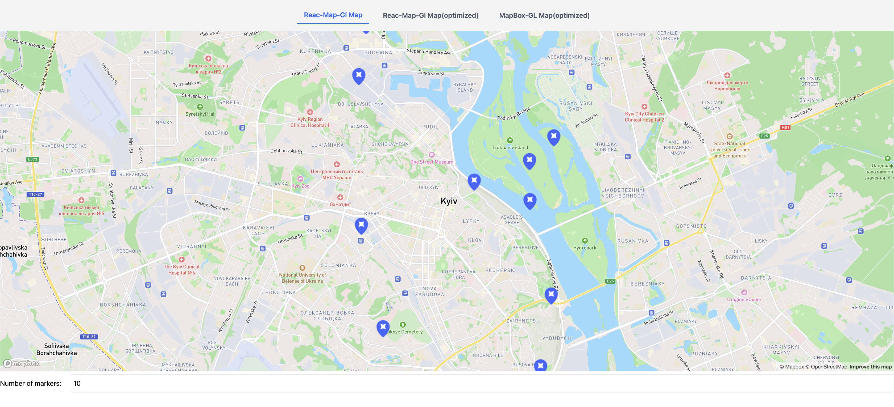

# React MapBox Comparison 🗺️

This project implements an interactive map using **React** and **Mapbox**, focusing on performance optimization and marker compression techniques.

## Features ✨

- **Mapbox Integration** – Seamlessly integrates Mapbox for rendering maps.
- **Marker Compression** – Reduces marker length to optimize performance.
- **Performance Comparison** – Includes different implementations to benchmark rendering efficiency.
- **UI Tabs** – Switch between different optimized map versions for direct comparison.

## Technologies Used 🛠️

- **React** (with functional components)
- **Mapbox GL JS**
- **React-Map-GL**
- **Optimization Strategies**

## Demo 📸



## Setup 🚀

1. Clone the repo:
2. Add .env file
3. Set VITE_REACT_MAPBOX_TOKEN that belongs to Mapbox Account:
   ```sh
   VITE_REACT_MAPBOX_TOKEN="pk.*"
   ```
4. Install dependencies:
   ```sh
   npm install
   ```
5. Start the development server:
   ```sh
   npm start
   ```

## Contributions 🤝

Feel free to fork, submit issues, or create pull requests!
